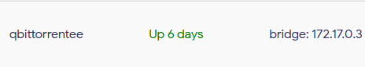
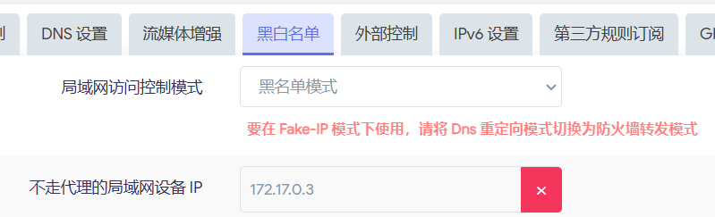

之前将istoreos作为家庭服务器的系统，在上面装了mihomo和qbittorrent，但是长时间挂着qbittorrent会导致会有上万条连接经过mihomo的内核，进而吃掉大量内存，因此，这里提出一种通过docker和openclash黑名单来实现BT流量绕过mihomo内核的方法。

## qbittorrent
qbittorrent通过docker安装，推荐这个[镜像](https://hub.docker.com/r/superng6/qbittorrentee)。网络必须bridge。

  

## openclash
把qbittorrent这个docker的ip加入openclash的黑名单里，即可实现来自这个docker的流量全部绕开mihomo核心，虽然会损失一些DHT，但是比起动不动就要重启openclash，下载慢点也没啥。

  

