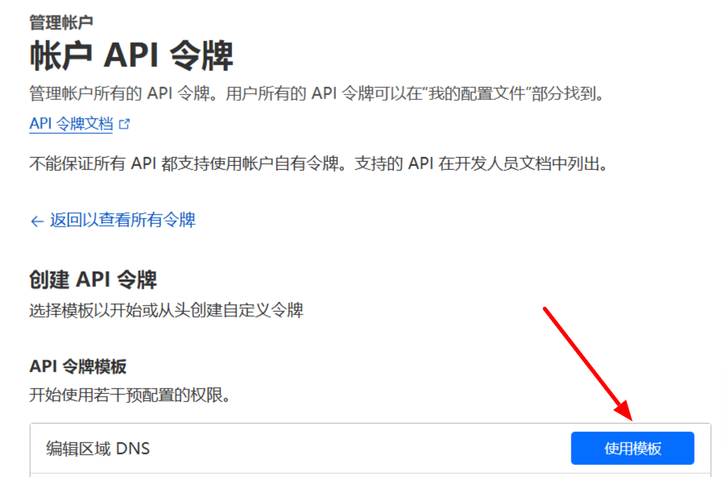
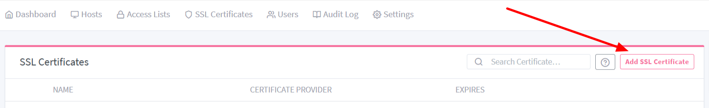
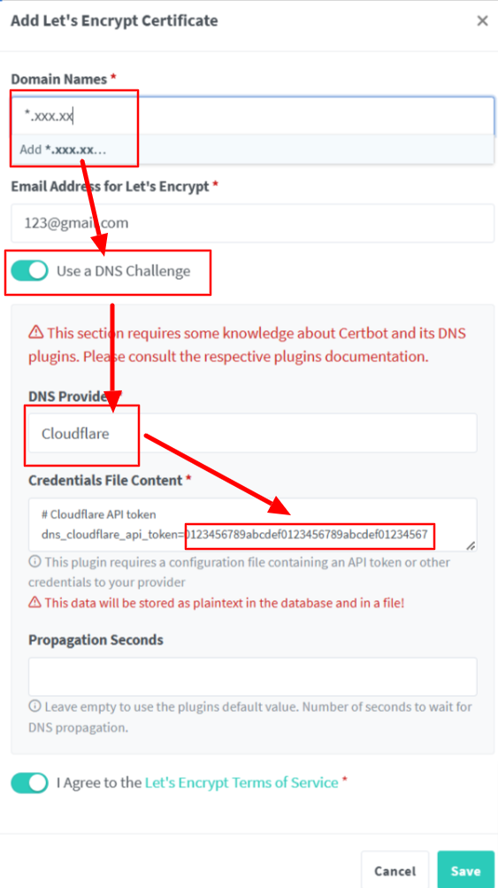
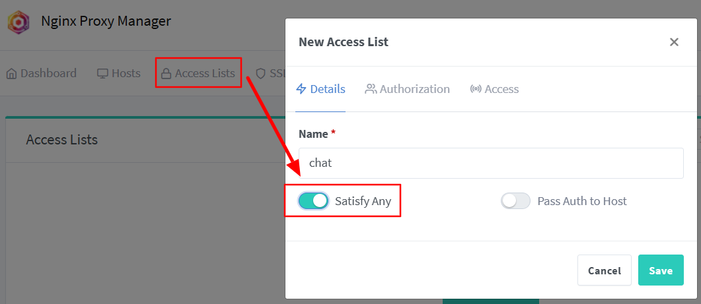
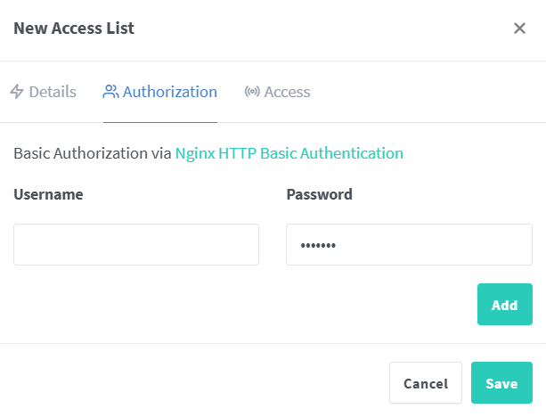
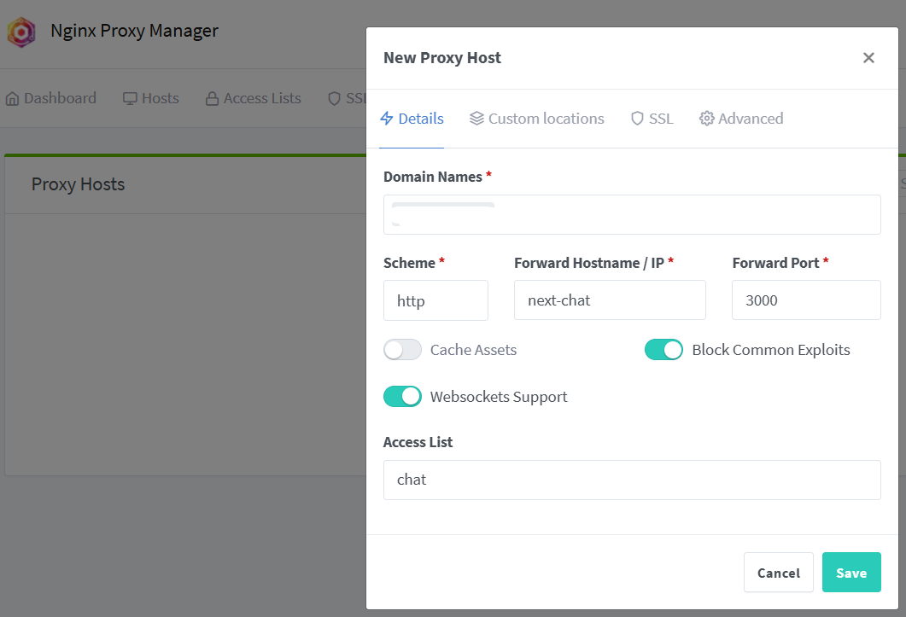
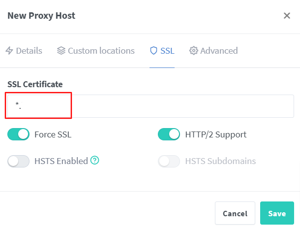
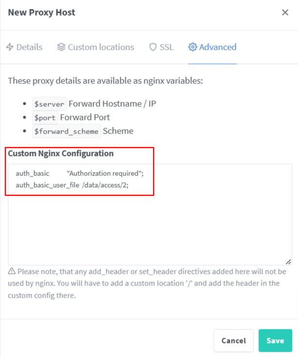
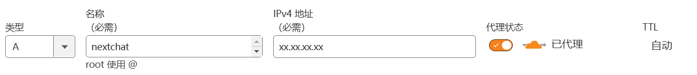

基于云服务器和域名，搭建一个随时可用的大模型api聊天UI，支持身份验证。


## 安装docker
以下方式适用于Debian，请使用`sudo -i`切换到`root`用户进行操作。

```
apt update
apt upgrade -y
apt install curl vim wget gnupg dpkg apt-transport-https lsb-release ca-certificates

curl -sSL https://download.docker.com/linux/debian/gpg | gpg --dearmor > /usr/share/keyrings/docker-ce.gpg
echo "deb [arch=$(dpkg --print-architecture) signed-by=/usr/share/keyrings/docker-ce.gpg] https://download.docker.com/linux/debian $(lsb_release -sc) stable" > /etc/apt/sources.list.d/docker.list

apt update
apt install docker-ce docker-ce-cli containerd.io docker-compose-plugin

# 安装 Docker Compose
curl -L https://github.com/docker/compose/releases/latest/download/docker-compose-Linux-x86_64 > /usr/local/bin/docker-compose
chmod +x /usr/local/bin/docker-compose

```

### 修改docker配置
限制日志文件大小，防止 Docker 日志塞满硬盘。

```
cat > /etc/docker/daemon.json << EOF
{
    "log-driver": "json-file",
    "log-opts": {
        "max-size": "20m",
        "max-file": "3"
    }
}
EOF
```
然后重启docker
```
systemctl restart docker
```
最后创建一个网络
```
docker network create ngpm
```

## 部署Nginx Proxy Manager
```
services:
  nginx-proxy-manager:
    image: 'docker.io/jc21/nginx-proxy-manager:latest'
    restart: unless-stopped
    ports:
      - '80:80'
      - '81:81'
      - '443:443'
    volumes:
      - ./data:/data
      - ./letsencrypt:/etc/letsencrypt

networks:
  default:
    external: true
    name: ngpm
```
然后运行
```
docker-compose up -d
```
### tip
- 记得开放服务器的这些端口

## 部署NextChat
懒得折腾，下面的配置只配置了 OpenRouter.ai 的 api 服务，如果需要聚合多平台的 api，可以参考这篇[记录](https://kravorn.github.io/2024/11/21/one-api-with-next-chat/)
```
services:
  next-chat:
    environment:
      - OPENAI_API_KEY=sk-xxxxx
      - BASE_URL=https://openrouter.ai/api
      - CUSTOM_MODELS=-all,+openai/chatgpt-4o-latest@OpenRouter,+openai/gpt-4o@OpenRouter,+anthropic/claude-3.5-sonnet@OpenRouter
      - DEFAULT_MODEL=openai/chatgpt-4o-latest
      - HOSTNAME=0.0.0.0
      - ENABLE_BALANCE_QUERY=1
    image: yidadaa/chatgpt-next-web
    restart: unless-stopped

networks:
  default:
    external: true
    name: ngpm
```

然后运行
```
docker-compose up -d
```


## 申请泛域名证书
- 获取 cloudflare API 令牌，API 令牌模板选择【编辑区域 DNS】



- 记录下 dns_cloudflare_api_token

- 进入NGPM管理页面，添加证书





## 添加身份验证
- 添加 Access List


- 配置账号密码



## 反代NextChat
- 创建Proxy Hosts




- 如果在Proxy Hosts中的Access List选中后，访问出现问题，请在 Advanced 里配置，详情可见[issue](https://github.com/NginxProxyManager/nginx-proxy-manager/issues/383)
```
auth_basic            "Authorization required";
auth_basic_user_file  /data/access/2;
```



## DNS解析
如果想通过`nextchat.xxxx.xx`(xxxx.xx是你的域名)访问NextChat服务，请记得添加一条A记录。

